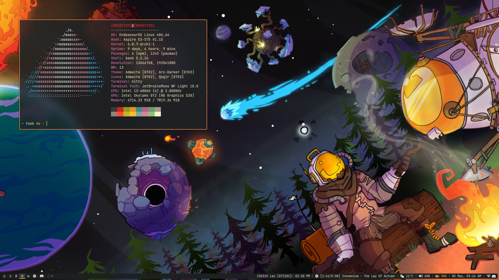
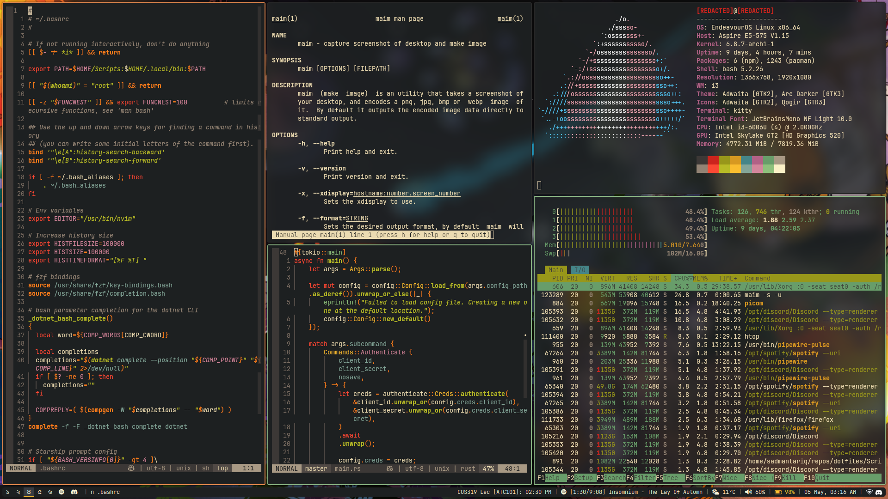

# Dotfiles

* [**Wallpaper**](https://i.postimg.cc/KYFHZpW6/jzvckqvu1jj51.png)
* **Fonts**: [JetBrains Mono](https://www.jetbrains.com/lp/mono/), [Noto Sans Bengali](https://fonts.google.com/noto/specimen/Noto+Sans+Bengali)
* **Colourscheme**: [Gruvbox](https://github.com/ellisonleao/gruvbox.nvim)
* **Terminal Emulator**: kitty
* **Status bar**: polybar
* **Key Remapper**: [rvaiya/keyd](https://github.com/rvaiya/keyd)

## Screenshots

